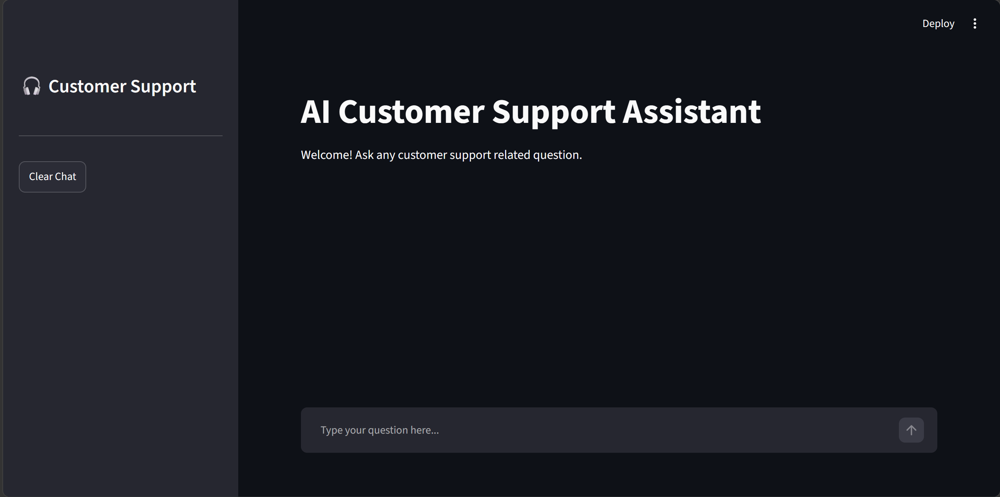
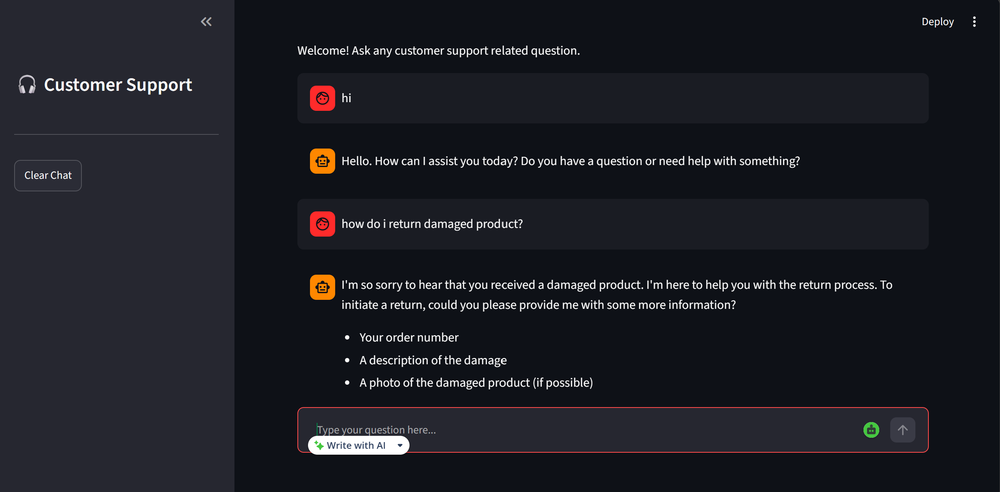

# 🎧 AI Customer Support Assistant

An intelligent, context-aware AI Customer Support Assistant built with **LangChain**, **Groq API** (`Llama 3.3 70B`), and **Streamlit**.

---

## 📌 Project Overview

The **AI Customer Support Assistant** is designed to handle customer inquiries efficiently and professionally. Built using modern LLM orchestration with **LangChain** and powered by Groq's high-speed inference engine running **Llama 3.3 70B**, this application provides automated, polite, and policy-compliant answers to customer support questions. It offers both an interactive **Streamlit Web UI** and a **Command Line Interface (CLI)**.

---

## ✨ Features

- **Persona-Driven System Prompts**: Responds with a polite, concise, professional tone without inventing company policies.
- **LangChain Expression Language (LCEL)**: High-speed, composable chain architecture (`Prompt | LLM | OutputParser`).
- **Dual User Interfaces**:
  - 🌐 **Streamlit Web UI**: Interactive web interface with chat state management and a "Clear Chat" feature.
  - 💻 **Terminal CLI**: Interactive command-line chat for quick local testing.
- **Ultra-Fast LLM Inference**: Powered by Groq LPU acceleration for sub-second response times.
- **Modular Test Suite**: Scripts to independently verify LLM connectivity, prompt rendering, and chain execution.

---

## 🛠️ Technologies Used

- **Python** (3.9+)
- **LangChain** (Core & Groq integration)
- **Groq API**
- **Llama 3.3 70B** (`llama-3.3-70b-versatile`)
- **Streamlit** (Web App Framework)
- **python-dotenv** (Environment variable management)

---

## 🧩 LangChain Components Used

1. **`ChatPromptTemplate`** (`langchain_core.prompts`): Defines system persona instructions and structures human input dynamic variables.
2. **`ChatGroq`** (`langchain_groq`): Manages connectivity, API authentication, temperature, and parameters for Groq LLMs.
3. **`StrOutputParser`** (`langchain_core.output_parsers`): Parses raw LLM chat messages into clean string responses.
4. **LCEL Pipeline** (`support_prompt | llm | output_parser`): Chains components together in a clean, readable, declarative pipeline.

---

## 📥 Installation

### 1. Clone the Repository
```bash
git clone https://github.com/Samyuktha13-06/DStarix_week2_ai_customer_support_assistant.git
cd ai_customer_support
```

### 2. Create and Activate Virtual Environment

- **Windows (PowerShell)**:
  ```powershell
  python -m venv venv
  .\venv\Scripts\Activate
  ```
- **macOS / Linux**:
  ```bash
  python3 -m venv venv
  source venv/bin/activate
  ```

### 3. Install Dependencies
```bash
pip install -r requirements.txt
```

---

## 🔑 Environment Variables

Create a `.env` file in the root directory by copying `.env.example`:

```bash
cp .env.example .env
```

Add your Groq API key to `.env`:

```env
GROQ_API_KEY="gsk_your_groq_api_key_here"
```

> **Note**: Obtain a free Groq API key from [console.groq.com/keys](https://console.groq.com/keys).

---

## 💻 Running CLI

Run the command-line interactive chat assistant:

```bash
python cli_chat.py
```

- Type your question at the `You:` prompt.
- Type `exit` or `quit` to exit the session.

---

## 🌐 Running Streamlit

Launch the Streamlit web application:

```bash
streamlit run app.py
```

Access the application in your browser at `http://localhost:8501`.

### 📸 Application Screenshots

#### 1. Home Screen


#### 2. Chat Conversation


---

## 📂 Project Structure

```
ai_customer_support/
│
├── app.py                      # Streamlit Web Application
├── cli_chat.py                 # Command Line Interface Chat Application
├── requirements.txt            # Project dependencies
├── .env.example                # Template for environment variables
├── .env                        # Local environment file (API keys)
├── .gitignore                  # Git ignore rules
├── README.md                   # Project documentation
│
├── assets/
│   └── screenshots/            # App UI Screenshots
│       ├── home.png            # Initial home screen screenshot
│       └── chat.png            # Active chat conversation screenshot
│
├── utils/
│   └── llm.py                  # ChatGroq LLM configuration
│
├── prompts/
│   └── support_prompts.py      # System prompt template & persona definition
│
├── chains/
│   └── support_chains.py       # LCEL chain (support_prompt | llm | output_parser)
│
├── docs/
│   └── sample_questions.md     # Benchmarking Q&A examples
│
├── test_llm.py                 # Unit test for LLM connection
├── test_prompts.py             # Unit test for prompt formatting
└── test_chain.py               # Unit test for end-to-end chain execution
```

---

## 💬 Sample Questions

Below are example customer inquiries handled by the assistant:

1. **Returns & Damaged Goods**:
   - *Question*: "How can I return a damaged product?"
   - *Response*: Guidance on keeping packaging, preparing order details, and starting the return/replacement process.

2. **Order Cancellations**:
   - *Question*: "Can I cancel my order?"
   - *Response*: Explanation of cancellation eligibility prior to shipment dispatch.

3. **Warranty Claims**:
   - *Question*: "Do you provide warranty?"
   - *Response*: Product documentation referral and warranty claim procedure.

4. **Payment Inquiries**:
   - *Question*: "What payment methods do you accept?"
   - *Response*: Summary of checkout payment processing options.

---


